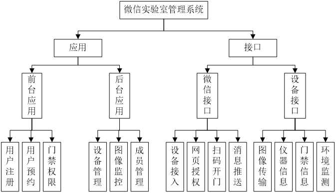

## 简介
 ### 软件功能

利用微信公众平台API开放接口技术为控制终端，以智能巡逻机器人为实物载体，充分利用人脸识别、云平台开发、数据库管理等技术，控制联网设备，将与实验室有关的各个子系统如安防、在线预约、实时监控、设备自检、环境参数采集等有机地结合在一起。通过微信公众平台的控制和管理，实现“以人为本”的全新微信端体验。

### 开发环境

* 开发语言：PHP，HTML+CSS+JavaScript
* 开发框架：ThinkPhP
* 数据库：MySQL
* 服务器：Apache
* 本版控制器：SVN

## 系统结构
### 系统功能结构
根据微信实验室管理系统的特点，可以将其分为应用和接口两部分。应用分为前台应用和后台应用，接口分为微信接口和设备接口。前台应用主要为普通学生提供实验室预约和使用功能，后台应用主要为实验室管理员提供设备、成员管理和监控功能。微信接口，帮助系统接入微信公众平台，并且提供消息推送、设备接入、扫码事件等功能。设备接口用于接收实验室硬件设备上传的图像、门禁、环境等信息。其中各个部分及其包括的功能模块如图1所示。

### 系统目录结构
按ThinkPHP框架的要求，我们应用放在Home目录下，控制器、视图和模型分别放在Controller目录、View目录和Model目录中。公共的图片、js和css等资源放在Public目录中，设备上传的图片放在Upload目录中。

